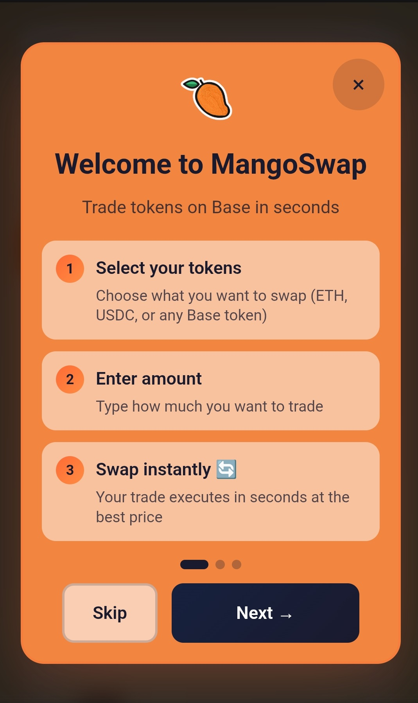
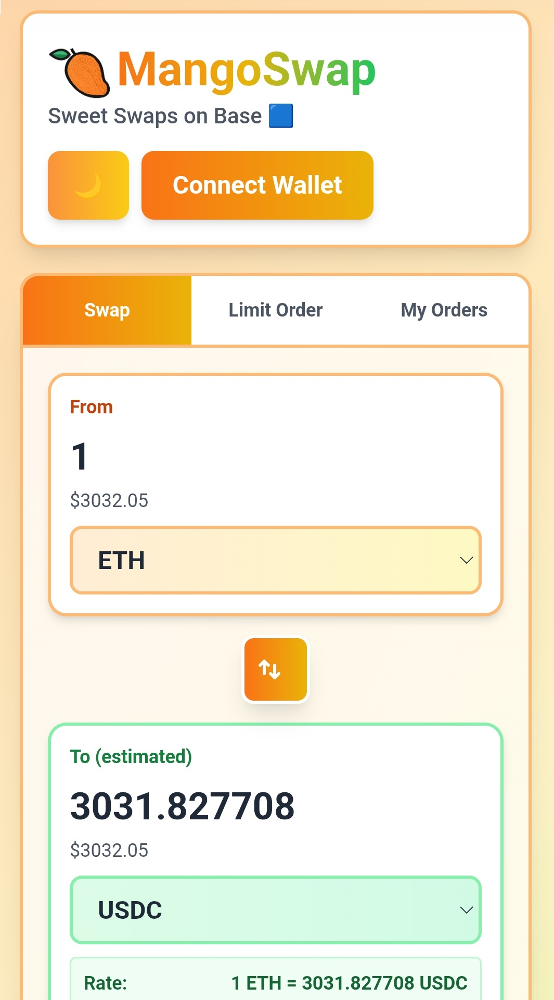
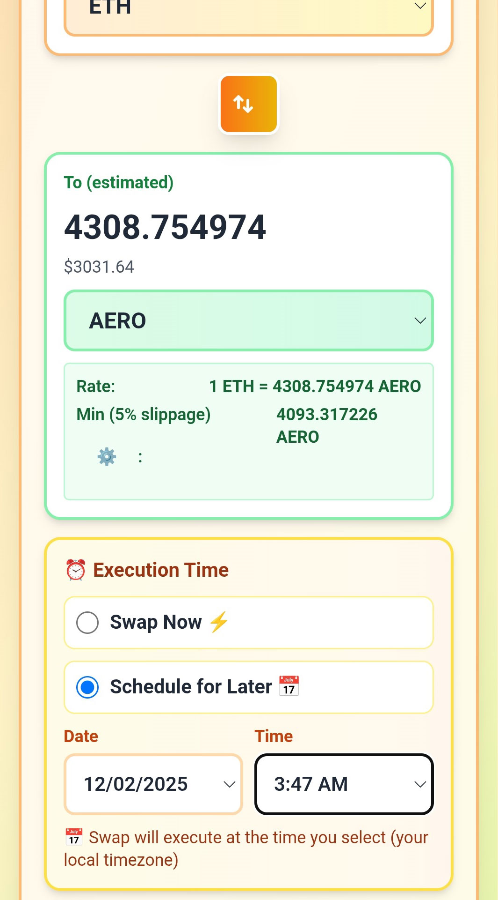

# 🥭 MangoSwap

**Sweet Swaps on Base** 🔵

[](https://base.org)
[](https://mangoswap.xyz)
[](https://opensource.org/licenses/MIT)

A next-generation decentralized exchange built on Base, offering seamless token swaps with scheduled trading and gas-free transactions.

🌐 **[Try MangoSwap →](https://mangoswap.xyz)**

---

[](docs/images/onboarding-hero.jpg)

*Trade tokens on Base in seconds with our intuitive interface*

---

## ✨ Features

### 🚀 Instant Swaps

Trade any token on Base in seconds with minimal slippage and best price execution.

### ⏰ Scheduled Swaps

Automate recurring trades on a daily, weekly, or monthly schedule. Perfect for DCA strategies.

### ⛽ Gas-Free Transactions

Powered by Coinbase Paymaster—trade without worrying about gas fees.

### 📦 Transaction Batching

Built with EIP-5792 support for efficient batch transactions and improved UX.

---

## 📸 Screenshots

[](docs/images/swap-interface.jpg)
[](docs/images/scheduled-trades.jpg)

*Clean, intuitive interface for seamless trading on Base*

---

## 🏗️ Built With

* **Frontend**: React, TypeScript, TailwindCSS
* **Blockchain**: Solidity, Base (Ethereum L2)
* **Web3**: Wagmi, Viem, RainbowKit
* **Smart Contracts**: EIP-5792 (Batch Transactions)
* **Sponsorship**: Coinbase Paymaster for gas-free txs

---

## 📝 Smart Contracts

**Base Mainnet:**

* Router Contract: [`0xb81fea65B45D743AB62a1A2B351f4f92fb1d4D16`](https://basescan.org/address/0xb81fea65B45D743AB62a1A2B351f4f92fb1d4D16)

All contracts are verified on Basescan.

---

## 🎯 Base Build Program

MangoSwap is part of the **Base Build** cohort, building the future of DeFi on Base alongside other innovative projects.

---

## 🚦 Getting Started

### Prerequisites

```
node >= 18.0.0
npm or yarn
```

### Installation

```bash
# Clone the repository
git clone https://github.com/plagtech/mangoswap.git

# Navigate to project directory
cd mangoswap

# Install dependencies
npm install

# Start development server
npm run dev
```

### Environment Variables

Create a `.env.local` file:

```
NEXT_PUBLIC_WALLET_CONNECT_PROJECT_ID=your_project_id
NEXT_PUBLIC_BASE_RPC_URL=https://mainnet.base.org
```

---

## 🤝 Contributing

Contributions are welcome! Feel free to open issues or submit pull requests.

1. Fork the repository
2. Create your feature branch (`git checkout -b feature/AmazingFeature`)
3. Commit your changes (`git commit -m 'Add some AmazingFeature'`)
4. Push to the branch (`git push origin feature/AmazingFeature`)
5. Open a Pull Request

---

## 📄 License

This project is licensed under the MIT License - see the [LICENSE](LICENSE) file for details.

---

## 🔗 Links

* **Website**: [mangoswap.xyz](https://mangoswap.xyz)
* **Twitter**: [@mngoswp](https://twitter.com/mngoswp)
* **Farcaster**: [@plag](https://farcaster.xyz/plag)
* **Base App**: plag.farcaster.eth
* **Base**: [base.org](https://base.org)

---

## 📬 Contact

Questions or feedback? Reach out on [Twitter](https://twitter.com/mngoswp) or [Farcaster](https://farcaster.xyz/plag).

---

Built with ❤️ on Base
